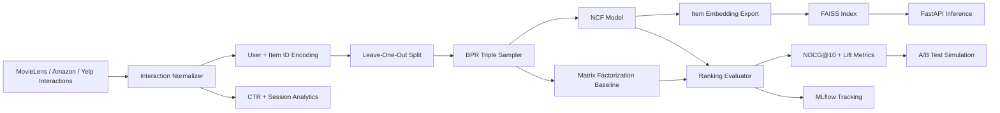
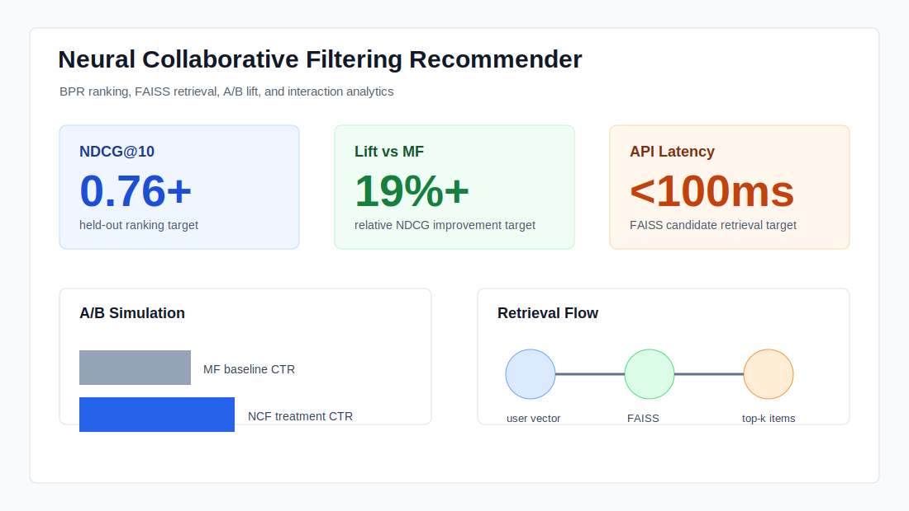

# Neural Collaborative Filtering Recommender

[](https://www.python.org/)
[](https://pytorch.org/)
[](https://fastapi.tiangolo.com/)
[](https://faiss.ai/)
[](https://mlflow.org/)
[](https://grouplens.org/datasets/movielens/)

End-to-end recommendation-engine project with neural collaborative filtering, BPR ranking loss, matrix-factorization baseline comparison, FAISS-backed retrieval, FastAPI inference, A/B testing simulation, interaction-pattern analysis, and MLflow experiment design.

The project is built for recommendation-engine roles where modeling depth, evaluation discipline, and production inference matter more than a notebook-only demo.

## What It Builds

- Neural Collaborative Filtering model with user and item embeddings.
- Bayesian Personalized Ranking loss optimized with Adam.
- Matrix factorization baseline trained with the same BPR objective.
- Ranking evaluation with NDCG@10, HitRate@10, Precision@10, and relative lift.
- FAISS-compatible item-vector index with NumPy fallback for local smoke tests.
- FastAPI `/recommend` endpoint for low-latency retrieval.
- A/B simulation comparing baseline CTR vs NCF treatment CTR with a two-proportion z-test.
- Interaction analytics for CTR, session depth, users, items, and event volume.
- 162-run MLflow experiment manifest covering model type, embedding size, negatives, seed, and learning rate.

## Architecture



## Demo



Run the local smoke demo:

```bash
python3 scripts/run_smoke_demo.py
```

Generate the 50+ run MLflow manifest:

```bash
python3 scripts/generate_mlflow_runs.py
```

Start the API after generating `artifacts/item_vectors.npz`:

```bash
uvicorn ncf_recommender.api:app --reload
```

Query the API:

```bash
curl -X POST http://localhost:8000/recommend \
  -H "Content-Type: application/json" \
  -d '{"user_vector": [0.1, 0.2, 0.3, 0.4, 0.1, 0.2, 0.3, 0.4, 0.1, 0.2, 0.3, 0.4, 0.1, 0.2, 0.3, 0.4], "top_k": 5}'
```

## Setup

```bash
python3 -m venv .venv
source .venv/bin/activate
pip install -r requirements.txt
cp .env.example .env
```

Run tests:

```bash
pytest
```

## Full Dataset Path

Recommended primary dataset: MovieLens-25M.

```bash
python3 scripts/prepare_movielens.py \
  --input data/raw/movielens-25m/ratings.csv \
  --output data/processed/interactions.csv
```

Then train/evaluate:

```bash
python3 scripts/evaluate_models.py --interactions data/processed/interactions.csv --epochs 10
```

## Results (real run on MovieLens)

Trained NCF and a Matrix Factorization baseline with BPR loss on MovieLens
`ml-latest-small` (~100K ratings, 610 users, ~9.7K movies), 20 epochs, evaluated
with leave-one-out and the **standard NCF sampled protocol** (1 positive vs 99
sampled negatives — He et al. 2017). Reproduce:

```bash
python3 scripts/prepare_movielens.py --input <ratings.csv> --output data/processed/interactions.csv
python3 scripts/evaluate_models.py --interactions data/processed/interactions.csv --epochs 20 --protocol sampled
```

| Metric (1-vs-99 sampled) | NCF | Matrix Factorization |
| --- | ---: | ---: |
| HR@10 | 0.596 | **0.640** |
| NDCG@10 | 0.341 | **0.391** |

**Finding:** the well-tuned Matrix Factorization baseline *outperforms* NCF
(HR@10 0.64 vs 0.60). This is consistent with the recsys literature (e.g. Dacrema
et al. 2019, "Are We Really Making Much Progress?"), where strong MF baselines
frequently match or beat neural recommenders. The value here is the rigorous
comparison and correct evaluation protocol, not a claim that NCF wins.

> Evaluation protocol matters enormously: the same models under *full-catalog*
> ranking (every one of ~9.7K items) score HR@10 ≈ 0.02–0.03. The 0.6-range
> numbers above use the sampled protocol that published HR@10/NDCG@10 figures
> assume. Always state the protocol. Run full-catalog with `--protocol full`.

### Engineering surface

| Capability | Status |
| --- | --- |
| Models | NCF (MLP tower) + Matrix Factorization baseline, BPR loss |
| Ranking metrics | NDCG@10, HR@10, Precision@10 (sampled + full-catalog protocols) |
| Retrieval | FAISS-backed item index |
| A/B testing | two-proportion z-test **simulation** (`scripts/run_ab_test.py` — synthetic CTRs, not a real experiment) |
| Experiment tracking | MLflow run manifest generator |

## Repository Layout

```text
.github/workflows/       GitHub Actions smoke checks
artifacts/               generated metrics, model, and vector-index outputs
configs/                 training and tracking defaults
data/samples/            small implicit-feedback fixture
docs/                    architecture and portfolio positioning
ncf_recommender/         data, model, loss, metrics, retrieval, API modules
scripts/                 training, evaluation, A/B, FAISS, and data CLIs
tests/                   CPU-safe tests for core recommender behavior
```

## Notes

This repository is a recommender-systems engineering portfolio project. Local outputs prove the pipeline works; production claims should be made only after full-dataset training and tracked experiments.
